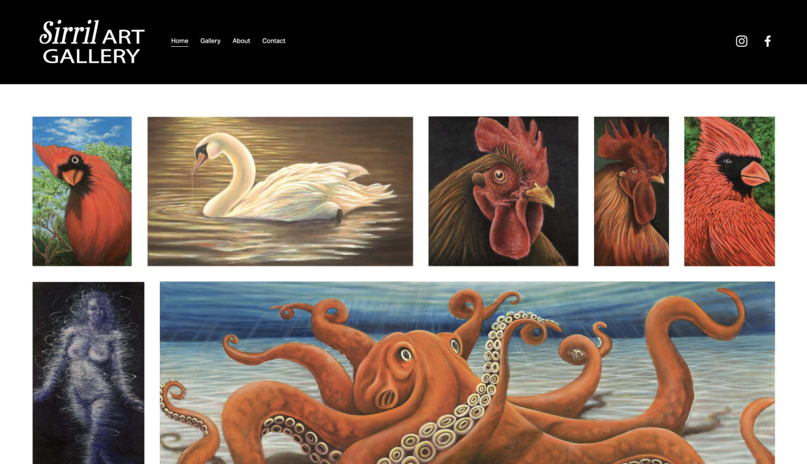

Custom cites typically range from large scale React projects, to static sites created with Gatsby. These projects involve the most planning and preparation, but are for clients demanding top performance or need to meet a truly unique set of requirements. Alternatively we find many customers will do much better at the end of the day with a CMS provider like Squarespace, and we can help with those sites as well.

 
<h1>Eagle Tester - Mobile Enerlytics</h1>
 
<iframe
    width="700"
    height="315"
    src="https://www.youtube.com/embed/5SCcIYdMGmE"
    title="YouTube video player"
    frameborder="0"
    allow="accelerometer; autoplay; clipboard-write; encrypted-media; gyroscope; picture-in-picture"
    allowfullscreen
></iframe>
 
<a href="https://www.sirrilartgallery.com">
    <h1>Sirril Art Gallery - Squarespace </h1>
</a>
 

